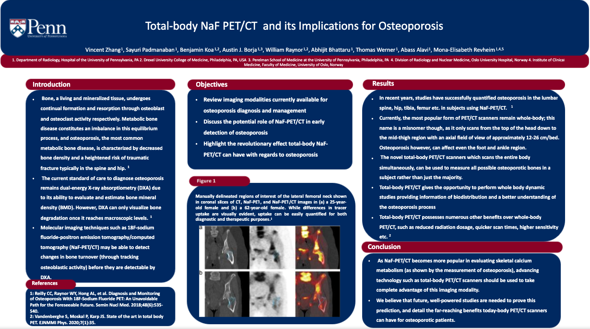

```{r setup, include=FALSE}
knitr::opts_chunk$set(echo = TRUE)
```

```{=html}
<div class="navbar navbar-default  navbar-fixed-top" role="navigation">
  <div class="container">
    <div class="navbar-header">
      <button type="button" class="navbar-toggle collapsed" data-toggle="collapse" data-target="#navbar">
        <span class="icon-bar"></span>
        <span class="icon-bar"></span>
        <span class="icon-bar"></span>
      </button>
      <a class="navbar-brand" href="../../index.html">Abhi Bhattaru</a>
    </div>
    <div id="navbar" class="navbar-collapse collapse">
      <ul class="nav navbar-nav">
        <li>
  <a href="../../index.html">Home</a>
</li>
<li>
  <a href="../../about.html">About</a>
</li>
<li class="dropdown">
  <a href="#" class="dropdown-toggle" data-toggle="dropdown" role="button" aria-expanded="false">
    Research
     
    <span class="caret"></span>
  </a>
  <ul class="dropdown-menu" role="menu">
    <li>
      <a href="../../research.html">Paper Gallery</a>
    </li>
    <li>
      <a href="../../listed_works.html">Listed Works</a>
    </li>
  </ul>
</li>
<li>
  <a href="../../shiny.html">Applications</a>
</li>
      </ul>
      <ul class="nav navbar-nav navbar-right">
        <li>
  <a href="https://www.linkedin.com/in/abhijit-bhattaru-3693a9177">
    <span class="fa fa-linkedin fa-lg"></span>
     
  </a>
</li>
<li>
  <a href="https://scholar.google.com/citations?view_op=list_works&amp;hl=en&amp;authuser=1&amp;user=WJHf9fsAAAAJ">
    <span class="fa fa-graduation-cap fa-lg"></span>
     
  </a>
</li>
<li>
  <a href="https://www.researchgate.net/profile/Abhi_Bhattaru">
    <span class="fa fa fa fa-university fa-lg"></span>
     
  </a>
</li>
<li>
  <a href="https://github.com/abhimaster2001">
    <span class="fa fa-github fa-lg"></span>
     
  </a>
</li>
<li>
  <a href="mailto:abhi.bhattaru@gmail.com">
    <span class="fa fa-envelope fa-lg"></span>
     
  </a>
</li>
      </ul>
    </div><!--/.nav-collapse -->
  </div><!--/.container -->
</div><!--/.navbar -->

<style>
p{
  font-size: 15px;
  margin-bottom: .05em;
}
h2{
font-weight: 500;
}
h3{
font-weight: 500;
}
h4{
font-weight: 500;
}
hr{
border: 1px solid gray;
}
title{
display: none;
}

.paper-listing {
  position: relative;
  overflow: hidden;
}

.paper-listing:hover .paper-title {
  opacity: 1;
}

.paper-listing:hover .paper-image img {
  filter: blur(2px);
}

.paper-image img {
  filter: blur(0px);
  transition: filter 0.3s ease-in;
  transform: scale(1.1);
}

.paper-title {
  position: absolute;
  top: 0;
  left: 0;
  height: 100%;
  width: 100%;
  background: rgb(179, 0, 71);
   
  /* typographic styles */
  color: white;
  font-size: 1.5em;
  font-weight: bold;
  text-decoration: none;
   
  /* position the text centrally*/
  display: flex;
  align-items: center;
  justify-content: center;
  
  /* hide the title by default */
  opacity: 0;
  transition: opacity .5s;
  
  z-index: 1;
}

img {
  width: 100%;
  height: auto;
}

@media (hover: none) { 
  .paper-title {
    opacity: 1;
    background: none;
  }
  .paper-image img {
    filter: blur(0px);
  }
}

</style>

```


<br> <br> <br>

```{r webdisplay, echo=FALSE}
library(shiny)
yaml_info<- rmarkdown::yaml_front_matter('SNMMI2020.Rmd')

HTML('<h2>', yaml_info$pagetitle, '</h2>' , '<hr>')

fluidRow(
    column(4,
      img(src=yaml_info$img_name),
      br(),
      p(yaml_info$date),
      br()
          ),
    column(8,
      HTML("</p>", yaml_info$description, "</p>"),
      br(),
          )
)
br()
HTML('<h4>', 'Posters', '</h4>' , '<hr>')

fluidRow()
column(6,
         HTML('
              <article class="paper-listing">
                <a class="paper-title" href="posters/FDGinIBD.png">View Poster</a>
                <div class="paper-image">
                  <a href="posters/FDGinIBD.png" download>
                    
                  </a>
                </div>
              </article>
              '))
column(6,
         HTML('
              <article class="paper-listing">
                <a class="paper-title" href="posters/petmrinvd.png">View Poster</a>
                <div class="paper-image">
                  <a href="posters/petmrinvd.png" download>
                    
                  </a>
                </div>
              </article>
              '))

column(6,
         HTML('
              <article class="paper-listing">
                <a class="paper-title" href="posters/petinarr.jpg">View Poster</a>
                <div class="paper-image">
                  <a href="posters/petinarr.jpg" download>
                    
                  </a>
                </div>
              </article>
              '))

column(6,
         HTML('
              <article class="paper-listing">
                <a class="paper-title" href="posters/petinpaathero.png">View Poster</a>
                <div class="paper-image">
                  <a href="posters/petinpaathero.png" download>
                    
                  </a>
                </div>
              </article>
              '))

column(6,
         HTML('
              <article class="paper-listing">
                <a class="paper-title" href="posters/petinmsk.png">View Poster</a>
                <div class="paper-image">
                  <a href="posters/petinmsk.png" download>
                    
                  </a>
                </div>
              </article>
              '))

column(6,
         HTML('
              <article class="paper-listing">
                <a class="paper-title" href="posters/paatheroscientific.jpg">View Poster</a>
                <div class="paper-image">
                  <a href="posters/paatheroscientific.jpg" download>
                    
                  </a>
                </div>
              </article>
              '))

column(6,
         HTML('
              <article class="paper-listing">
                <a class="paper-title" href="posters/petinaorticsteno.jpg">View Poster</a>
                <div class="paper-image">
                  <a href="posters/petinaorticsteno.jpg" download>
                    
                  </a>
                </div>
              </article>
              '))


column(6,
         HTML('
              <article class="paper-listing">
                <a class="paper-title" href="posters/tbosteo.jpg">View Poster</a>
                <div class="paper-image">
                  <a href="posters/tbosteo.jpg" download>
                    
                  </a>
                </div>
              </article>
              '))

column(6,
         HTML('
              <article class="paper-listing">
                <a class="paper-title" href="posters/subclinicalathero.png">View Poster</a>
                <div class="paper-image">
                  <a href="posters/subclinicalathero.png" download>
                    
                  </a>
                </div>
              </article>
              '))

  
fluidRow()


br()
HTML('<h4>', 'Published Abstracts', '</h4>' , '<hr>')
      HTML('
      <ol>
        <li><b>A Bhattaru</b>, A Borja, V Zhang, KV Rojulpote, T Werner, A Alavi, ME Revheim. FDG-PET/CT as the superior imaging modality for inflammatory bowel disease. <a href="http://jnm.snmjournals.org/content/61/supplement_1/1159.abstract?sid=cc52ec7c-d567-496f-a7e3-16769aba25d3">Journal of Nuclear Medicine. May 1, 2020. </a>
    </li>
        <li><b>A Bhattaru</b>, V Zhang, E Hancin, A Borja, KV Rojulpote, T Werner, ME Revheim, A Alavi. Potential applications of FDG-PET/MRI in detecting vascular dementia. <a href="http://jnm.snmjournals.org/content/61/supplement_1/1149.abstract?sid=cc52ec7c-d567-496f-a7e3-16769aba25d3">Journal of Nuclear Medicine. May 1, 2020. </a>
    </li>
        <li>C Rojulpote, <b>A Bhattaru</b>, S Patil, K Gonuguntla, ME Revheim, B Koa, E Hancin, T Werner, A Alavi. Role of PET Imaging in Detection and Management of Arrhythmias. <a href="http://jnm.snmjournals.org/content/61/supplement_1/1365.abstract?sid=cc52ec7c-d567-496f-a7e3-16769aba25d3">Journal of Nuclear Medicine. May 1, 2020. </a>
    </li>
        <li>V Zhang, <b>A Bhattaru</b>, C Rojulpote, A Borja, A Madiraju, T Werner, A Alavi, ME Revheim. Role of PET/CT Imaging in the Assessment of Pulmonary Artery Atherosclerosis. <a href="http://jnm.snmjournals.org/content/61/supplement_1/1376.abstract?sid=cc52ec7c-d567-496f-a7e3-16769aba25d3">Journal of Nuclear Medicine. May 1, 2020. </a>
    </li>
        <li>E Hancin, A Borja, <b>A Bhattaru</b>, SM Seraj, KV Rojulpote, T Werner, A Alavi, ME Revheim. Applications of FDG-PET/CT and NaF-PET/CT in the Surgical Management of Musculoskeletal Infection. <a href="http://jnm.snmjournals.org/content/61/supplement_1/1156.abstract?sid=cc52ec7c-d567-496f-a7e3-16769aba25d3">Journal of Nuclear Medicine. May 1, 2020. </a>
    </li>
        <li>V Zhang, C Rojulpote, AJ Borja, A Madiraju, <b>A Bhattaru</b>, S Patil, K Gonuguntla, TJ Werner, PF Hoilund-Carlsen, ME Revheim, A Alavi. NaF Uptake in the Pulmonary Artery Stratified by Systemic Blood Pressure: A Novel Methodology. <a href="http://jnm.snmjournals.org/content/61/supplement_1/1621.abstract?sid=cc52ec7c-d567-496f-a7e3-16769aba25d3">Journal of Nuclear Medicine. May 1, 2020. </a>
    </li>
        <li>S Patil, K Gonuguntla, C Rojulpote, V Zhang, B Koa, <b>A Bhattaru</b>, ME Revheim, T Werner, A Alavi. Role of PET Imaging in Aortic Stenosis. <a href="http://jnm.snmjournals.org/content/61/supplement_1/1375.abstract?sid=cc52ec7c-d567-496f-a7e3-16769aba25d3">Journal of Nuclear Medicine. May 1, 2020. </a>
    </li>
        <li>V Zhang, S Padmanabhan, B Koa, A Borja, WY Raynor, A Madiraju, <b>A Bhattaru</b>, KV Rojulpote, C Rajapakse, T Werner, ME Revheim, A Alavi. Total-Body NaF-PET/CT and its Implications for Osteoporosis. <a href="http://jnm.snmjournals.org/content/61/supplement_1/1143.abstract?sid=cc52ec7c-d567-496f-a7e3-16769aba25d3">Journal of Nuclear Medicine. May 1, 2020. </a>
    </li>
        <li>C Rojulpote, S Patil, K Gonuguntla, ME Revheim, R Ghorpade, P Narayanareddy, <b>A Bhattaru</b>, TJ Werner, O Gerke, PF Hoilund-Carlsen, A Alavi. Role of NaF-PET/CT in Detecting and Quantifying Global Cardiac Subclinical Atherosclerosis in Healthy Individuals with an Optimal Lipid Profile and its Association with Blood Pressure. <a href="http://jnm.snmjournals.org/content/61/supplement_1/1634.abstract?sid=cc52ec7c-d567-496f-a7e3-16769aba25d3">Journal of Nuclear Medicine. May 1, 2020. </a>
    </li>
      </ol>
')

br()
```