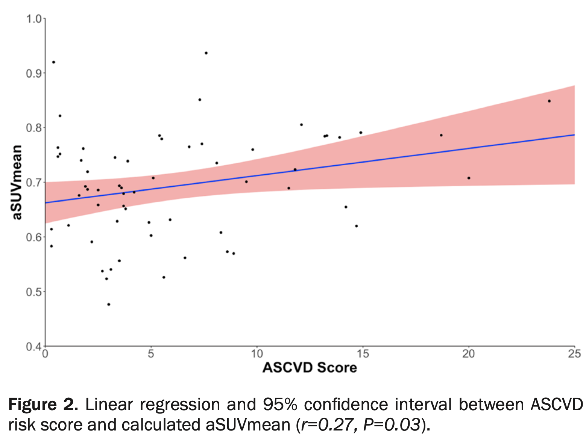

***


\noindent
Pooled Cohort Equations (PCE) combines metabolic and non-metabolic parameters to predict the 10- year risk of atherosclerotic cardiovascular disease (ASCVD). Therefore, we hypothesize that ASCVD risk score is correlated to global cardiac microcalcification, as assessed by 18F-sodium fluoride-positron emission tomography/ computed tomography (NaF-PET/CT). Sixty-one individuals (53.4 $\pm$ 8.9 years, 32 females, 100% Caucasian) without known ASCVD underwent NaF-PET/CT imaging. Global cardiac average SUVmean (aSUVmean), also known as the Alavi-Carlsen Calcification Score, was calculated across manually defined regions of interest on each axial slice for each individual. The 10-year ASCVD risk score was determined for each individual using the PCE as per ACC/AHA guidelines, and then individuals were categorized into low-, borderline-, intermediate-, and high-risk groups based on their score. Linear regression analysis was applied to compare each individual’s ASCVD score and aSUVmean. Global cardiac aSUVmean stratified by groups estimated by 10-year ASCVD risk score were 0.67 $\pm$ 0.09 for low risk (n=32), 0.70 $\pm$ 0.11 for borderline risk (n=10), 0.72 $\pm$ 0.10 for intermediate risk (n=17), and 0.78 $\pm$ 0.10 for high risk (n=2). ASCVD risk score was significantly correlated to aSUVmean (r=0.27, P=0.03). This is among the first studies to compare ASCVD risk scores to cardiac plaque burden as assessed by NaF-PET/CT. Large, prospective studies are needed to further investigate the potential of NaF uptake in ASCVD.

***

```{r, Rlogo, echo=FALSE, out.width='3in', fig.align='center', fig.pos='htbp'}

```

\begin{center}


Full Text:\href {http://www.ajnmmi.us/files/ajnmmi0121390.pdf}{AJNMMI 0121390} | Pubmed: \href {https://www.ncbi.nlm.nih.gov/pubmed/33329933}{33329933}


\end{center}
