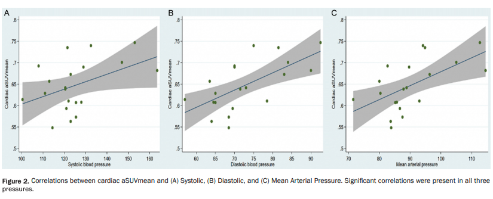

***


\noindent
**Background:**We used 18F-sodium fluoride (NaF) to assess early atherosclerosis in the global heart in asymptomatic individuals with a coronary calcium score of zero and without a formal diagnosis of hypertension. We hypothesized that these individuals might present with subclinical atherosclerosis that correlates with systolic, diastolic and mean arterial pressure (SBP, DBP, and MAP).

\noindent
**Methods:** We identified 20 asymptomatic individuals (41.6 ± 13.8 years, 8 females) from the CAMONA trial with C-reactive protein $\geq$ 3 mg/L, no smoking history, diabetes (fasting blood glucose <126 mg/dl) and dyslipidemia per the Adult Treatment Panel III Guidelines: untreated LDL <160 mg/dL, total cholesterol <240 mg/dL, HDL >40 mg/dL. All underwent PET/CT imaging 90 minutes after NaF injection (2.2 Mbq/Kg). The global cardiac average SUVmean (aSUVmean) was calculated for each individual. Correlation coefficients and linear regression models were employed for statistical analysis.

\noindent
**Results:**Significant positive correlation was revealed between global cardiac NaF uptake and all blood pressures: SBP (r=0.44, P=0.05), DBP (r=0.64, P=0.002), and MAP (r=0.59, P=0.007). After adjusting for age and gender, DBP and MAP were independent predictors of higher global cardiac NaF uptake.

\noindent
**Conclusions:**NaF-PET/CT for detecting and quantifying subclinical atherosclerosis in asymptomatic individuals revealed that cardiac NaF uptake correlated independently with DBP and MAP.

***

\begin{center}

```{r, Rlogo, echo=FALSE, out.width='4.5in', fig.align='center', fig.pos='htbp'}

```

Full Text:\href {http://www.ajcd.us/files/ajcd0114898.pdf}{AJCD 0114898} | Pubmed: \href {https://pubmed.ncbi.nlm.nih.gov/32685267/}{32685267}


\end{center}
