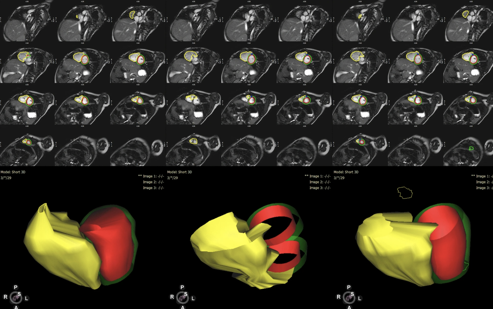

***


\noindent
Ventricular contouring of cardiac magnetic resonance imaging is the gold standard for volumetric analysis for repaired tetralogy of Fallot (rTOF), but can be time-consuming and subject to variability. A convolutional neural network (CNN) ventricular contouring algorithm was developed to generate contours for mostly structural normal hearts. We aimed to improve this algorithm for use in rTOF and propose a more comprehensive method of evaluating algorithm performance. We evaluated the performance of a ventricular contouring CNN, that was trained on mostly structurally normal hearts, on rTOF patients. We then created an updated CNN by adding rTOF training cases and evaluated the new algorithm’s performance generating contours for both the left and right ventricles (LV and RV) on new testing data. Algorithm performance was evaluated with spatial metrics (Dice Similarity Coefficient (DSC), Hausdorff distance, and average Hausdorff distance) and volumetric comparisons (e.g., differences in RV volumes). The original Mostly Structurally Normal (MSN) algorithm was better at contouring the LV than the RV in patients with rTOF. After retraining the algorithm, the new MSN+rTOF algorithm showed improvements for LV epicardial and RV endocardial contours on testing data to which it was naïve (N=30; e.g., DSC 0.883 vs. 0.905 for LV epicardium at end diastole, p<0.0001) and improvements in RV end-diastolic volumetrics (median %error 8.1 vs 11.4, p=0.0022). Even with a small number of cases, CNN-based contouring for rTOF can be improved. This work should be extended to other forms of congenital heart disease with more extreme structural abnormalities. Aspects of this work have already been implemented in clinical practice, representing rapid clinical translation. The combined use of both spatial and volumetric comparisons yielded insights into algorithm errors.

***

```{r, Rlogo, echo=FALSE, out.width='3in', fig.align='center', fig.pos='htbp'}

```

\begin{center}


DOI:\href {https://doi.org/10.1007/s00246-020-02518-5}{10.1007/s00246-020-02518-5} | Pubmed: \href {https://pubmed.ncbi.nlm.nih.gov/33394116/}{33394116}


\end{center}
