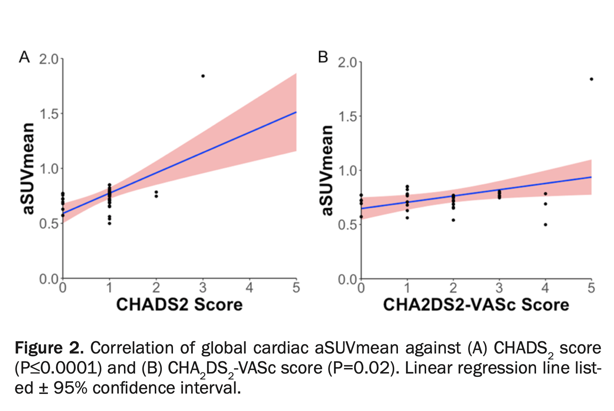

***


\noindent
CHADS2 and CHA2DS2-VASc scores are used to estimate the risk of strokes in patients with atrial fibrillation. We sought to determine the global quantification of cardiovascular molecular calcification in high risk individuals by NaF-PET/CT and compare it with CHADS2 and CHA2DS2-VASc scores. We identified 40 high risk individuals for cardiovascular disease from the Cardiovascular Molecular Calcification Assessed by 18F-NaF PET CT (CAMONA) trial and calculated CHADS2 and CHADS2-VASc scores for each. Ninety minutes after NaF injection (2.2 Mbq/kg), PET/CT imaging was performed. CT imaging was done for attenuation correction and anatomic correlation. The global cardiac uptake was calculated from regions of interest manually drawn on axial PET/CT images made in OsirixMD. Global cardiac average SUVmean (aSUVmean) values were calculated, and linear regression analysis was employed for statistical purposes. Subjects had mean age of 55 $\pm$  11.9 SD years, (Range: 23-73 years), female 55%. The sample consisted of subjects with a mean aSUVmax of 2.9 $\pm$ 1.4, aSUVmean was 0.8 $\pm$ 0.2, CHADS2 0.9 $\pm$ 0.6 (Range: 0-3), CHA2DS2-VASc 1.8 $\pm$ 1.3 (Range: 0-5). Based on the linear regression models, we found a direct correlation between global cardiac aSUVmean and CHADS2 score (r=0.58, P$\leq$ 0.0001) and also between global cardiac aSUVmean and CHA2DS2-VASc (r=0.37, P=0.01). Based on the results of our study we conclude that patients with a higher CHADS2 and CHA2DS2-VASc scores had a higher atherosclerotic burden and could be at greater risk of cardiovascular events. These scoring systems can help with risk stratification for predicting future adverse atherosclerotic events.


***

```{r, Rlogo, echo=FALSE, out.width='3in', fig.align='center', fig.pos='htbp'}

```

\begin{center}


Full Text:\href {http://www.ajnmmi.us/files/ajnmmi0115872.pdf}{AJNMMI 0115872} | Pubmed: \href {https://www.ncbi.nlm.nih.gov/pubmed/33329931}{33329931}


\end{center}
