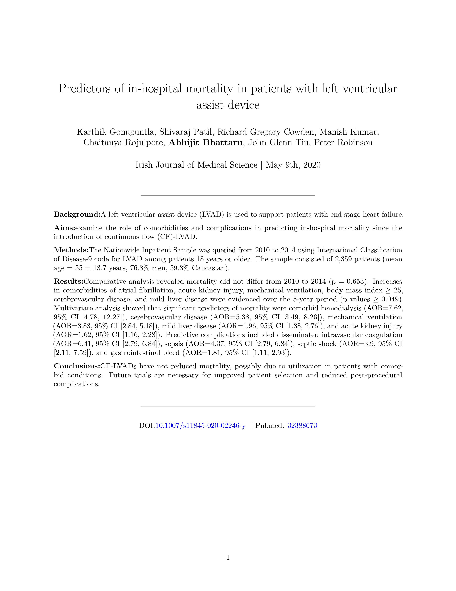
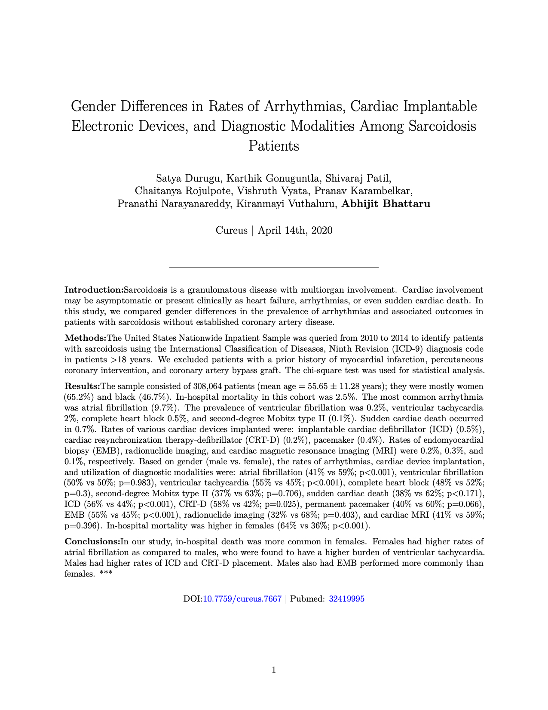
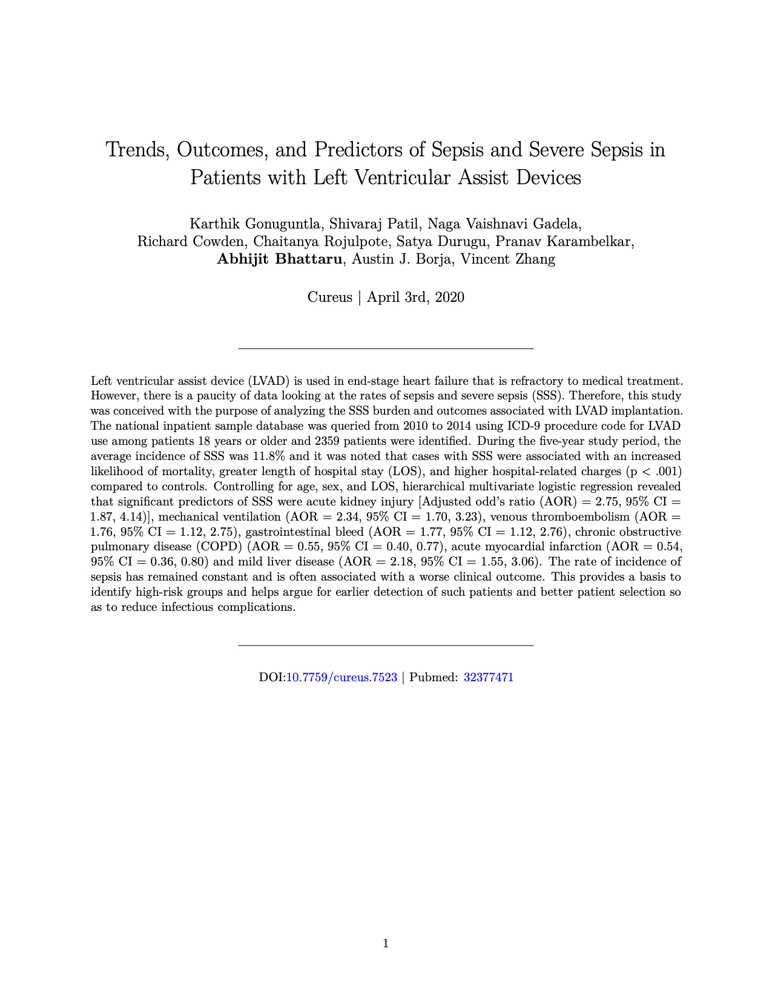
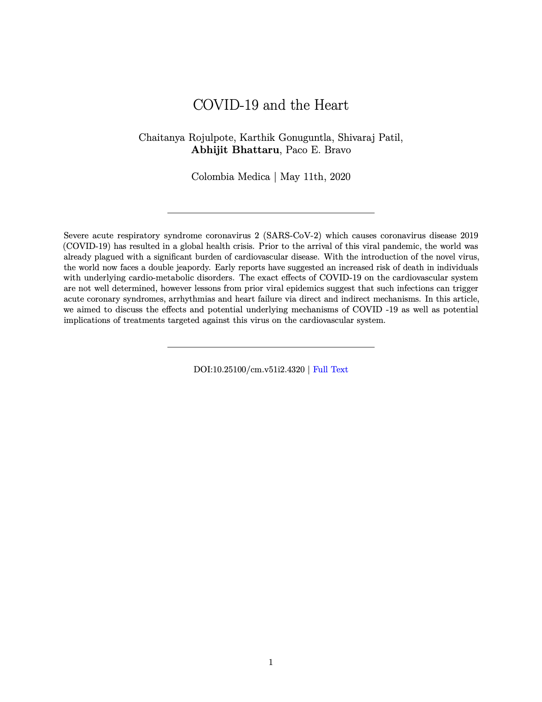
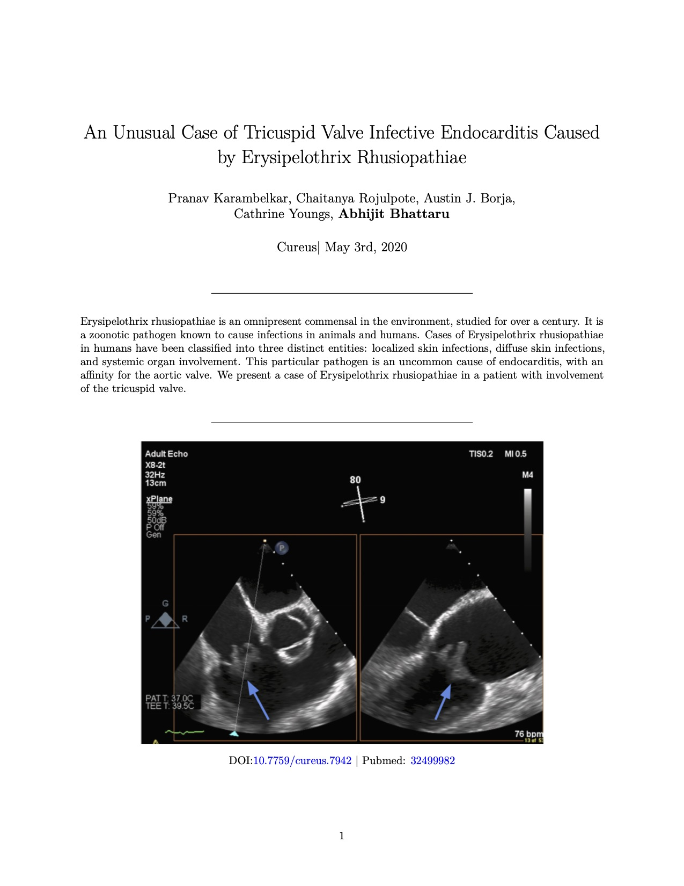
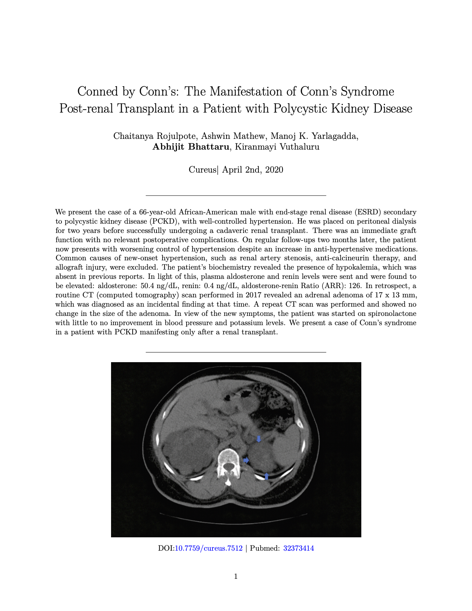

```{r setup, include=FALSE}
knitr::opts_chunk$set(echo = TRUE)
```

```{=html}
<style>

p{
  font-size: 15px;
  margin-bottom: .05em;
}
h2{
font-weight: 500;
}
h3{
font-weight: 500;
}
h4{
font-weight: 500;
}
hr{
border: 1px solid gray;
}
title{
display: none;
}

.paper-listing {
  position: relative;
  overflow: hidden;
}

.paper-listing:hover .paper-title {
  opacity: 1;
}

.paper-listing:hover .paper-image img {
  filter: blur(2px);
}

.paper-image img {
  filter: blur(0px);
  transition: filter 0.3s ease-in;
  transform: scale(1.1);
}

.paper-title {
  position: absolute;
  top: 0;
  left: 0;
  height: 100%;
  width: 100%;
  background: rgb(179, 0, 71);
   
  /* typographic styles */
  color: white;
  font-size: 1.5em;
  font-weight: bold;
  text-decoration: none;
   
  /* position the text centrally*/
  display: flex;
  align-items: center;
  justify-content: center;
  
  /* hide the title by default */
  opacity: 0;
  transition: opacity .5s;
  
  z-index: 1;
}

img {
  width: 100%;
  height: auto;
}

@media (hover: none) { 
  .paper-title {
    opacity: 1;
    background: none;
  }
  .paper-image img {
    filter: blur(0px);
  }
}

</style>
```


<h2>Research Papers</h2><hr>
<h4>Original Science</h4>
```{r OriginalScience, tidy=TRUE, echo=FALSE}
library(shiny)

#row1
fluidRow(
  column(3,
         HTML('
              <article class="paper-listing">
                <a class="paper-title" href="papers/LVADIrish/LVADIrish.pdf">In Hospital Mortality LVAD</a>
                <div class="paper-image">
                  <a href="/papers/LVADIrish/LVADIrish.pdf" download>
                    
                  </a>
                </div>
              </article>
              ')),
  column(3,
         HTML('
              <article class="paper-listing">
                <a class="paper-title" href="papers/GenderSarcoid/GenderSarcoid.pdf">Gender in Sarcoidosis</a>
                <div class="paper-image">
                  <a href="papers/GenderSarcoid/GenderSarcoid.pdf" download>
                    
                  </a>
                </div>
              </article>
              ')),
  column(3,
         HTML('
              <article class="paper-listing">
                <a class="paper-title" href="papers/LVADSepsis/LVADSepsis.pdf">LVAD Sepsis</a>
                <div class="paper-image">
                  <a href="papers/LVADSepsis/LVADSepsis.pdf" download>
                    
                  </a>
                </div>
              </article>
              ')),
  column(3)
)

```

<br>
<h4>Reviews</h4>
```{r ReviewArticles, tidy=TRUE, echo=FALSE}
#row1

fluidRow(
  column(3,
         HTML('
              <article class="paper-listing">
                <a class="paper-title" href="papers/COVIDHeart/COVIDHeart.pdf">COVID-19 in Heart</a>
                <div class="paper-image">
                  <a href="papers/COVIDHeart/COVIDHeart.pdf" download>
                    
                  </a>
                </div>
              </article>
              ')
         )
)
```

<br>
<h4>Case Reports</h4>
```{r CaseReports, tidy=TRUE, echo=FALSE}
#row1
fluidRow(
  column(3,
         HTML('
              <article class="paper-listing">
                <a class="paper-title" href="papers/Endocarditis/Endocarditis.pdf">Endocarditis Erysipelothrix Rhusiopathiae</a>
                <div class="paper-image">
                  <a href="papers/Endocarditis/Endocarditis.pdf" download>
                    
                  </a>
                </div>
              </article>
              ')
         ),
  column(3,
         HTML('
              <article class="paper-listing">
                <a class="paper-title" href="papers/Conns/Conns.pdf">Conned by Conns</a>
                <div class="paper-image">
                  <a href="papers/Conns/Conns.pdf" download>
                    
                  </a>
                </div>
              </article>
              ')
         )
)
```


<br>